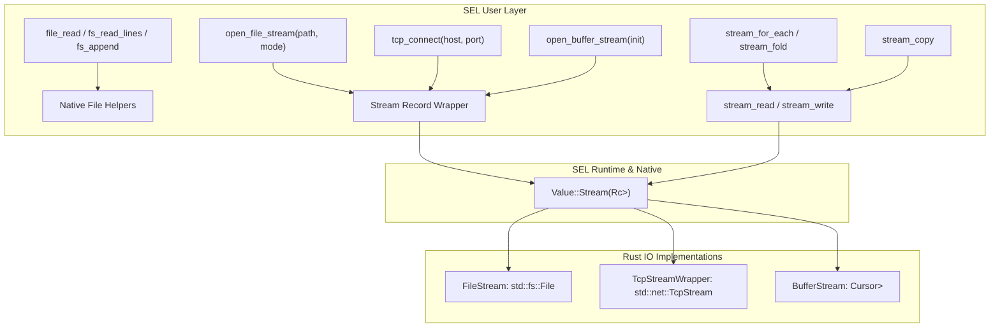

# Filesystem Helper Functions and Extensible Stream I/O Plan

This document details the architectural design and implementation plan for adding helper functions to read and write entire files, as well as an extensible I/O stream abstraction in SEL for chunked data processing across files, in-memory buffers, and network sockets.

## Goal Description

SEL currently provides basic whole-file operations (`fs_read`, `fs_write`, `fs_exists`, `fs_list`, `fs_delete`). However, it lacks:
1. Complete filesystem helpers for appending, reading/writing binary byte sequences, and line-based operations.
2. A unified, extensible **Stream abstraction** capable of processing data in chunks (e.g. 4KB/64KB buffers) without loading entire datasets into memory.
3. Extensibility of the stream abstraction to other I/O sources, specifically **network sockets (TCP)** and **in-memory buffers**.

This proposal introduces:
- A new native `Value::Stream` type wrapping a trait object `Box<dyn SelStream>`.
- File stream adapters (`open_file_stream(path, mode)`), network socket adapters (`tcp_connect(host, port)`, `tcp_listen(host, port)`, `tcp_accept(listener)`), and in-memory buffer adapters (`open_buffer_stream([data])`).
- First-class record wrappers enabling ergonomic dot-access method calls (e.g. `s.read(1024)`, `s.write("data")`, `s.read_line()`, `s.close()`).
- Tail-recursive (TCO) functional stream combinators in `src/core.sel` (`stream_for_each`, `stream_fold`, `stream_chunks`, `stream_lines`, `stream_copy`, `with_stream`, and coroutine-based `stream_generator`).
- Comprehensive whole-file helper functions (`fs_append`, `fs_read_bytes`, `fs_write_bytes`, `fs_append_bytes`, `fs_read_lines`, `fs_write_lines`, and `file_*` aliases).

---

## User Review Required

> [!IMPORTANT]
> **Stream EOF Representation**: When reading from a stream (`stream_read(s, size)` or `stream_read_line(s)`), when the end of the stream or EOF is reached, the function returns `nil`. This is idiomatic in SEL (similar to `first([]) == nil`), enabling clean condition loops like `while chunk != nil`. Empty reads where 0 bytes were requested return `""`.

> [!NOTE]
> **Polymorphism via Records & Free Functions**: All stream operations will be usable both via **record dot notation** (e.g. `stream.read(1024)`) and via **free functions** compatible with SEL pipelines (e.g. `stream |> stream_read(1024)` or `stream_read(stream, 1024)`). This gives maximum idiomatic flexibility.

---

## Architecture Overview



---

## Proposed Changes

Order of execution:
1. `src/stream.rs` [NEW] — Core trait `SelStream`, implementations (`FileStream`, `TcpStreamWrapper`, `BufferStream`, `TcpListenerWrapper`), and native functions.
2. `src/value.rs` [MODIFY] — Add `Value::Stream` variant and formatting logic.
3. `src/lib.rs` [MODIFY] — Export `pub mod stream;`.
4. `src/internal.rs` [MODIFY] — Equality, type reflection, whole-file helpers (`fs_append`, bytes operations), and environment registration.
5. `src/core.sel` [MODIFY] — Prelude functions for files, record wrappers, pipelines, combinators, and resource management.
6. `tests/test_stream.sel` [NEW] — End-to-end integration tests for whole-file helpers, chunked file streams, socket networking, in-memory buffers, and coroutine streams.
7. Documentation [MODIFY] — Update `docs/src/content/docs/core.md` and `README.md`.

---

### Component 1: `src/stream.rs`

#### [NEW] `src/stream.rs`
Defines the `SelStream` trait and its concrete implementations:

```rust
use std::cell::RefCell;
use std::io::{BufRead, BufReader, Cursor, Read, Write};
use std::net::{TcpListener, TcpStream};
use std::rc::Rc;
use crate::diagnostics::SelError;
use crate::lexer::Loc;
use crate::types::intern;
use crate::value::Value;

pub type Result<T> = std::result::Result<T, SelError>;

pub trait SelStream: std::fmt::Debug {
    fn read_chunk(&mut self, max_bytes: usize) -> std::io::Result<Vec<u8>>;
    fn read_line(&mut self) -> std::io::Result<Option<String>>;
    fn read_all(&mut self) -> std::io::Result<Vec<u8>>;
    fn write_chunk(&mut self, data: &[u8]) -> std::io::Result<usize>;
    fn flush(&mut self) -> std::io::Result<()>;
    fn close(&mut self) -> std::io::Result<()>;
    fn is_closed(&self) -> bool;
    fn stream_type(&self) -> &'static str;
    fn stream_info(&self) -> String;
}
```

Includes:
- **`FileStream`**:
  Wraps `Option<std::fs::File>` with a `BufReader` for line buffering. Supports open modes: `:read`, `:write`, `:append`, `:read_write`.
- **`TcpStreamWrapper`**:
  Wraps `Option<std::net::TcpStream>` with buffered read support.
- **`BufferStream`**:
  Wraps `Cursor<Vec<u8>>` allowing in-memory reading and writing, plus extraction back to a string via `buffer_stream_to_string`.
- **`TcpListenerWrapper`**:
  Manages a bound `TcpListener` providing non-blocking or blocking `accept()` returning a new `TcpStreamWrapper`.
- **Native SEL functions**:
  - `stream_open_file(loc, args)`
  - `stream_open_buffer(loc, args)`
  - `tcp_connect(loc, args)`
  - `tcp_listen(loc, args)`
  - `tcp_accept(loc, args)`
  - `stream_read(loc, args)`
  - `stream_read_bytes(loc, args)`
  - `stream_read_line(loc, args)`
  - `stream_read_all(loc, args)`
  - `stream_write(loc, args)`
  - `stream_flush(loc, args)`
  - `stream_close(loc, args)`
  - `stream_is_closed(loc, args)`
  - `stream_type_of(loc, args)`
  - `buffer_stream_to_string(loc, args)`
  - `is_stream(loc, args)`

---

### Component 2: `src/value.rs`

#### [MODIFY] `src/value.rs`
- Add `Stream(Rc<RefCell<Box<dyn crate::stream::SelStream>>>)` variant to `pub enum Value`.
- In `format_value(val: &Value)`:
  ```rust
  Value::Stream(s) => s.borrow().stream_info(),
  ```

---

### Component 3: `src/internal.rs`

#### [MODIFY] `src/internal.rs`
- Add `Value::Stream(_)` to `value_type_name`:
  ```rust
  Value::Stream(_) => "stream",
  ```
- In `is_value_equal`:
  ```rust
  (Value::Stream(a), Value::Stream(b)) => Rc::ptr_eq(a, b),
  ```
- Add whole-file helper primitives:
  - `fs_append(loc, &args)`: Uses `std::fs::OpenOptions::new().create(true).append(true).open(path)`.
  - `fs_read_bytes(loc, &args)`: Uses `std::fs::read(path)` and returns `Value::make_list` of `Value::Integer`.
  - `fs_write_bytes(loc, &args)`: Takes list of integers and writes raw bytes.
  - `fs_append_bytes(loc, &args)`: Appends list of integers as raw bytes.
- Register all stream and socket native functions in `load()`:
  ```rust
  e.insert(intern("stream_open_file"), Value::NativeFunction(crate::stream::stream_open_file));
  e.insert(intern("stream_open_buffer"), Value::NativeFunction(crate::stream::stream_open_buffer));
  e.insert(intern("tcp_connect"), Value::NativeFunction(crate::stream::tcp_connect));
  e.insert(intern("tcp_listen"), Value::NativeFunction(crate::stream::tcp_listen));
  e.insert(intern("tcp_accept"), Value::NativeFunction(crate::stream::tcp_accept));
  e.insert(intern("stream_read"), Value::NativeFunction(crate::stream::stream_read));
  e.insert(intern("stream_read_bytes"), Value::NativeFunction(crate::stream::stream_read_bytes));
  e.insert(intern("stream_read_line"), Value::NativeFunction(crate::stream::stream_read_line));
  e.insert(intern("stream_read_all"), Value::NativeFunction(crate::stream::stream_read_all));
  e.insert(intern("stream_write"), Value::NativeFunction(crate::stream::stream_write));
  e.insert(intern("stream_flush"), Value::NativeFunction(crate::stream::stream_flush));
  e.insert(intern("stream_close"), Value::NativeFunction(crate::stream::stream_close));
  e.insert(intern("stream_is_closed"), Value::NativeFunction(crate::stream::stream_is_closed));
  e.insert(intern("stream_type_of"), Value::NativeFunction(crate::stream::stream_type_of));
  e.insert(intern("buffer_stream_to_string"), Value::NativeFunction(crate::stream::buffer_stream_to_string));
  e.insert(intern("is_stream"), Value::NativeFunction(crate::stream::is_stream));
  ```

---

### Component 4: `src/core.sel`

#### [MODIFY] `src/core.sel`
Extend with stdlib prelude additions:

```sel
// --- Filesystem Conveniences & Whole-File Helpers ---
fs_exists path := file_system(:exists, path)
fs_read path := file_system(:read, path)
fs_write path content := file_system(:write, path, content)
fs_append path content := file_system(:append, path, content)
fs_read_bytes path := file_system(:read_bytes, path)
fs_write_bytes path bytes := file_system(:write_bytes, path, bytes)
fs_append_bytes path bytes := file_system(:append_bytes, path, bytes)
fs_list path := file_system(:list, path)
fs_delete path := file_system(:delete, path)

// Line-based helpers
fs_read_lines path := string_split(fs_read(path), "\n")
fs_write_lines path lines := fs_write(path, string_join(lines, "\n"))

// Idiomatic file_* aliases
file_read path := fs_read(path)
file_write path content := fs_write(path, content)
file_append path content := fs_append(path, content)
file_read_lines path := fs_read_lines(path)
file_write_lines path lines := fs_write_lines(path, lines)
file_read_bytes path := fs_read_bytes(path)
file_write_bytes path bytes := fs_write_bytes(path, bytes)
file_append_bytes path bytes := fs_append_bytes(path, bytes)
file_exists path := fs_exists(path)
file_delete path := fs_delete(path)

// --- Stream Abstraction & Constructors ---
make_stream_record handle kind := {
    handle: handle,
    type: kind,
    read: \size -> stream_read(handle, size),
    read_bytes: \size -> stream_read_bytes(handle, size),
    read_line: \-> stream_read_line(handle),
    read_all: \-> stream_read_all(handle),
    write: \data -> stream_write(handle, data),
    flush: \-> stream_flush(handle),
    close: \-> stream_close(handle),
    is_closed: \-> stream_is_closed(handle)
}

open_file_stream path mode := make_stream_record(stream_open_file(path, mode), :file)
open_file_stream path := open_file_stream(path, :read)

open_buffer_stream initial := do
    h := stream_open_buffer(initial)
    rec := make_stream_record(h, :buffer)
    rset(rec, :to_string, \-> buffer_stream_to_string(h))
end
open_buffer_stream := \-> open_buffer_stream("")

// Sockets
net_connect host port := make_stream_record(tcp_connect(host, port), :tcp)
net_listen host port := tcp_listen(host, port)
net_accept listener := make_stream_record(tcp_accept(listener), :tcp)

// --- Stream Chunk Processors & Combinators ---
stream_for_each s chunk_size f := do
    chunk := stream_read(s, chunk_size)
    if chunk == nil || chunk == "" then
        nil
    else do
        f(chunk)
        stream_for_each(s, chunk_size, f)
    end
end

stream_fold s chunk_size acc f := do
    chunk := stream_read(s, chunk_size)
    if chunk == nil || chunk == "" then
        acc
    else
        stream_fold(s, chunk_size, f(acc, chunk), f)
end

stream_copy src dst chunk_size := do
    chunk := stream_read(src, chunk_size)
    if chunk == nil || chunk == "" then
        nil
    else do
        stream_write(dst, chunk)
        stream_copy(src, dst, chunk_size)
    end
end
stream_copy src dst := stream_copy(src, dst, 8192)

with_stream s f := try
    res := f(s)
    stream_close(s)
    res
catch err do
    stream_close(s)
    error(err)
end

file_each_chunk path chunk_size f := with_stream(open_file_stream(path, :read), \s -> do
    stream_for_each(s, chunk_size, f)
end)

stream_generator s chunk_size := co_create(\_ -> do
    stream_for_each(s, chunk_size, \chunk -> yield(chunk))
    nil
end)
```

---

### Component 5: Tests

#### [NEW] `tests/test_stream.sel`
Comprehensive test suite validating:
1. Whole-file helpers (`file_write`, `file_append`, `file_read_lines`, `file_read_bytes`, `file_write_bytes`).
2. File chunk stream processing (`open_file_stream`, `stream_for_each`, `stream_fold`, `stream_copy`).
3. In-memory buffer stream (`open_buffer_stream`, reading in chunks, writing, `.to_string()`).
4. TCP socket streams (`net_listen`, `net_connect`, `net_accept`, reading/writing across socket, `close`).
5. Coroutine generator stream (`stream_generator`, `co_resume`).
6. `with_stream` resource cleanup.

---

## Verification Plan

### Automated Tests
Run full test suite (which includes `tests/test_stream.sel` automatically via test folder runner):
```bash
cargo test
```
Verify specific tests:
```bash
cargo test --test main test_tests_folder
```

### Manual Verification
1. Run `tests/test_stream.sel` directly with CLI:
   ```bash
   cargo run -- tests/test_stream.sel
   ```
2. Interactive REPL verification:
   ```bash
   cargo run
   # Test in-memory buffer stream:
   b := open_buffer_stream("Hello SEL Stream!")
   b.read(5)   // "Hello"
   b.read(6)   // " SEL S"
   b.close()
   ```
