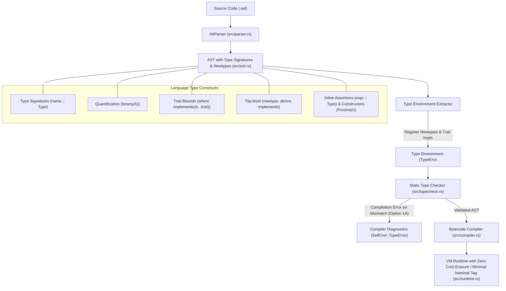

# Exploration & Architectural Plan: Advanced Type System for SEL

## Goal Description

As SEL matures as an expressive, high-performance functional language, introducing an ergonomic, expressive **Type System** bridges the gap between dynamic scripting flexibility and static safety guarantees. 

Based on the agreed design foundations:
```sel
filter   :: forany(A) : (A -> bool), [A] -> [A]
is_empty :: forany(A) : [A] -> bool

unique :: forany(A) where implements(A, :comparable) : [A] -> [A]
unique [] := []
unique [h | t] when filter(\x -> h == x, t) |> is_empty := [h | unique(t)]
unique [_ | t] := unique(t)

// Top-level nominal type and trait declarations
newtype Foo := { c: int }
derive(Foo, :comparable)
// Or custom implementation:
// implements(Foo, :comparable, \a, b -> a.c == b.c)

{c: 10} :: record // ok, generic base type
Foo({c: 10}) :: Foo // ok, constructor creates nominal Foo
```

This plan outlines the architecture, formal grammar, type-checking semantics, trait system, and phased implementation path to integrate this type system into SEL as a **Strict Static Gate (Option 1A)**.



---

## 1. Comparative Analysis: How Modern Functional Languages Model Types

| Feature | Haskell | Rust | TypeScript | Zig | **Proposed SEL Type System** |
| :--- | :--- | :--- | :--- | :--- | :--- |
| **Signature Syntax** | `f :: a -> b` | `fn f<T>(x: T) -> R` | `const f = (x: T): R` | `fn f(comptime T: type, x: T) R` | `f :: forany(A) : A -> B` |
| **Parametric Polymorphism** | `forall a.` (implicit or explicit) | Generics `<T>` | Generics `<T>` | `comptime` type parameters | `forany(A, B, ...)` |
| **Ad-Hoc Polymorphism (Traits)** | Typeclasses `(Eq a) =>` | Traits `where T: Eq` | Interfaces / Structural | Comptime duck-typing | `where implements(A, :trait)` |
| **Compile-Time Execution** | Template Haskell | Const eval & Proc Macros | Type-level computation | First-class `comptime` | First-class `comptime { ... }` blocks |
| **Nominal vs Structural** | Nominal (data / newtype) | Nominal (struct / enum) | Structural (Branded types) | Nominal (structs) | **Dual**: Structural records (`{c 10}`), Nominal `newtype` (`Foo`) |
| **Casting / Branding** | Constructor `Foo x` | `From` / `Into` / Transmute | `x as Foo` | `@as(Foo, x)` | `cast(Foo, expr)` with shape validation |
| **Runtime Overhead** | Zero-cost erasure | Zero-cost monomorphization | Zero-cost erasure | Zero-cost compile-time | **Hybrid**: Zero-cost erased signatures + reified nominal tags on `cast` |

---

## 2. Syntax & Formal Grammar Specification

### 2.1 Function & Variable Type Signatures (`::`)
A type signature associates an identifier with a quantified, constrained, or concrete type:
```sel
// Standalone top-level signature
filter   :: forany(A) : (A -> bool), [A] -> [A]
is_empty :: forany(A) : [A] -> bool

// Signatures with trait constraints
unique   :: forany(A) where implements(A, :comparable) : [A] -> [A]

// Concrete multi-argument function
add      :: int, int -> int

// Simple variable signature
pi       :: float
```

### 2.2 Inline Type Assertions (`expr :: Type`)
Expressions can be asserted against a type at compile-time:
```sel
{c 10} :: record       // Passes: conforms to generic record base type
{c 10} :: { c: int }    // Passes: structural type match
```

### 2.3 Type Expression Grammar
```ebnf
TypeSignature  ::= ("forany" "(" TypeVarList ")")? ("where" ConstraintList)? ":" FunctionType
                 | FunctionType

TypeVarList    ::= Identifier ("," Identifier)*
ConstraintList ::= Constraint ("," Constraint)*
Constraint     ::= "implements" "(" Identifier "," Atom ")"

FunctionType   ::= ParamTypeList "->" TypeExpr
                 | TypeExpr

ParamTypeList  ::= TypeExpr ("," TypeExpr)*

TypeExpr       ::= PrimaryType ("|" PrimaryType)*  (* Optional Union types *)

PrimaryType    ::= BaseType
                 | TypeVar
                 | NominalType
                 | ListType
                 | RecordType
                 | "(" FunctionType ")"

BaseType       ::= "int" | "float" | "bool" | "string" | "char" | "symbol" | "nil" | "any" | "record" | "list" | "fn"
TypeVar        ::= UpperIdentifier (e.g. A, B, T)
NominalType    ::= UpperIdentifier (e.g. Foo, Person)
ListType       ::= "[" TypeExpr "]"
RecordType     ::= "{" (Identifier ":" TypeExpr ("," Identifier ":" TypeExpr)*)? "}"
```

---

## 3. Top-Level Declarations & Nominal Types (`newtype`, `derive`, `implements`)

### 3.1 Declarative Syntax at Module Top-Level
Rather than a complex compile-time sandbox (`comptime`), type and trait definitions are clean, top-level declarative statements parsed directly into the AST:

```sel
newtype Foo := { c: int }
derive(Foo, :comparable)
// Custom implementation alternative:
// implements(Foo, :comparable, \a, b -> a.c == b.c)
```

### 3.2 Nominal Types & Constructor Generation
- In SEL, records `{c: 10}` are **structural**: any two records with the same field names and types are structurally compatible.
- `newtype Foo := { c: int }` creates a distinct **nominal identity** `Foo` and automatically exposes a constructor function:
  `Foo : { c: int } -> Foo`
- Even though `{c: 10}` has the exact shape `{ c: int }`, it cannot be passed to a function expecting `Foo` without explicit constructor wrapping:
  ```sel
  process_foo :: Foo -> int
  process_foo f := f.c

  // process_foo({c: 10})      <-- Hard Compile-time Type Error! (expected Foo, found { c: int })
  // process_foo(Foo({c: 10})) <-- OK!
  ```

### 3.3 Zero-Cost Representation & Transparent Dot-Access
- At runtime, with strict static typing (Option 1A) guaranteeing correctness, nominal types do not require expensive runtime wrappers or boxing.
- Field accesses `foo.c` transparently access the underlying representation.

### 3.4 Traits & Ad-Hoc Polymorphism (`implements`, `derive`)
Traits are identified by atoms: `:comparable`, `:showable`, `:orderable`, `:hashable`, `:iterable`.
- **Built-in Traits**:
  - `:comparable`: Defines equality `==` and `!=`. Built-in types (`int`, `float`, `string`, `bool`, `char`, `symbol`, lists, records) implement it natively.
- **`derive(Foo, :comparable)`**:
  - Automatically synthesizes the trait implementation by delegating equality recursively across all fields of `Foo`.
- **Manual `implements(Type, :trait, fn)`**:
  - Allows user-defined equality or behaviors:
    ```sel
    newtype CaseInsensitive := { text: string }
    implements(CaseInsensitive, :comparable, \a, b -> 
        string_lowercase(a.text) == string_lowercase(b.text)
    )
    ```

---

## 4. Architectural Integration in SEL

```
               ┌──────────────────────┐
               │    AltParser         │
               │   (src/parser.rs)    │
               └──────────┬───────────┘
                          │ AST with TypeSignatures & Comptime
                          ▼
               ┌──────────────────────┐
               │   Comptime Engine    │  <-- Evaluates comptime blocks in VM
               │   (src/comptime.rs)  │  <-- Registers Newtypes, Traits, Derives
               └──────────┬───────────┘
                          │ Populated TypeEnv
                          ▼
               ┌──────────────────────┐
               │  Static Type Checker │  <-- Bidirectional checking & inference
               │  (src/typecheck.rs)  │  <-- Verifies forany & trait constraints
               └──────────┬───────────┘  <-- Emits SelWarning / SelError
                          │ Validated AST
                          ▼
               ┌──────────────────────┐
               │   Bytecode Compiler  │  <-- Compiles AST to Chunks
               │   (src/compiler.rs)  │  <-- Lowers cast(...) to OpCode::Cast
               └──────────┬───────────┘
                          │
                          ▼
               ┌──────────────────────┐
               │      SEL VM          │  <-- Value::Nominal(id, value)
               │   (src/runtime.rs)   │  <-- Fast equality & trait dispatch
               └──────────────────────┘
```

### 4.1 AST Modifications (`src/ast.rs`)
```rust
#[derive(Debug, Clone)]
pub enum TypeExpr {
    Base(Loc, BaseTypeKind),             // int, float, bool, string, record, list, any
    Var(Loc, u32),                       // A, B, T
    Nominal(Loc, u32),                   // Foo, Person
    List(Loc, Box<TypeExpr>),            // [A]
    Record(Loc, Vec<(u32, TypeExpr)>),   // { c: int }
    Function(Loc, Vec<TypeExpr>, Box<TypeExpr>), // (A -> bool), [A] -> [A]
    Union(Loc, Vec<TypeExpr>),           // A | B
}

#[derive(Debug, Clone)]
pub struct TraitConstraint {
    pub loc: Loc,
    pub type_var: u32,
    pub trait_name: u32, // atom symbol id, e.g. :comparable
}

#[derive(Debug, Clone)]
pub struct TypeSignature {
    pub loc: Loc,
    pub forany_vars: Vec<u32>,
    pub constraints: Vec<TraitConstraint>,
    pub fn_type: TypeExpr,
}

// Additions to Ast:
Ast::TypeSignature(Loc, u32, TypeSignature),       // name :: Sig
Ast::TypeAssert(Loc, Box<Ast>, TypeExpr),          // expr :: Type
Ast::Comptime(Loc, Vec<Ast>),                      // comptime { ... }
```

### 4.2 Runtime Value Model (`src/value.rs`)
```rust
#[derive(Debug, Clone)]
pub struct NominalValue {
    pub type_id: u32,        // symbol ID of nominal type name (e.g. Foo)
    pub inner: Box<Value>,    // underlying value (e.g. Record { c: 10 })
}

pub enum Value {
    // Existing variants...
    Nominal(Rc<NominalValue>),
    // ...
}
```
- **Equality (`==`) in VM**:
  - When comparing two `Value::Nominal`:
    1. Verify `type_id` matches.
    2. Check if a custom `:comparable` handler was registered for `type_id`.
    3. If so, invoke the handler; otherwise, recursively compare `inner` values.

---

## 5. Phased Implementation Roadmap

### Phase 1: Grammar, AST & Type Signatures Parser
- [ ] Add `TokenKind::ColonColon` or two-colon consecutive lookahead in `AltParser`.
- [ ] Implement parser for `TypeExpr`, `forany(...)`, `where implements(...)`, and standalone `name :: Sig`.
- [ ] Implement inline type assertion `expr :: Type`.
- [ ] Add AST nodes for `TypeSignature`, `TypeExpr`, and `Ast::TypeAssert`.
- [ ] Write unit tests verifying parsing of generic function signatures, lists, records, and higher-order functions.

### Phase 2: `comptime` Execution & Nominal Types
- [ ] Implement AST node `Ast::Comptime(Loc, Vec<Ast>)`.
- [ ] Create `src/comptime.rs` to execute `comptime` blocks during module compilation.
- [ ] Implement compiler builtins:
  - `newtype Name := Shape`
  - `derive(Name, :trait)`
  - `implements(Name, :trait, handler)`
- [ ] Add `Value::Nominal` variant to `src/value.rs` with transparent dot-access forwarding.
- [ ] Add `cast(Type, value)` bytecode opcode and runtime implementation.

### Phase 3: Static Type Checker & Trait Constraint Verifier
- [ ] Create `src/typecheck.rs` (or extend `src/analysis.rs`):
  - Type environment tracking defined signatures, newtypes, and traits.
  - Bidirectional type checking: check AST function bodies against declared signatures.
  - Generic instantiation: unify `forany(A)` variables with argument types at call sites.
  - Constraint satisfaction: verify that instantiated type arguments satisfy `where implements(A, :trait)`.
- [ ] Diagnostics: Emit clear, actionable compiler warnings or errors when type contracts or trait constraints fail.

### Phase 4: Standard Library Prelude & Trait Implementations
- [ ] Register core type signatures in `src/core.sel` (`filter`, `map`, `is_empty`, `unique`, `length`, `reduce`).
- [ ] Register standard traits (`:comparable`, `:showable`, `:orderable`, `:hashable`).
- [ ] Add comprehensive test suite covering the user's scratch example end-to-end.

---

## 6. Design Choices & Discussion Questions

> [!IMPORTANT]
> Before beginning implementation, your guidance on these key design choices will ensure the type system fits your exact preferences:

1. **Diagnostic Severity**:
   - **Option A (Gradual / Advisory)**: Type mismatches emit rich compiler **warnings**, but code can still run dynamically (like Dialyzer or TypeScript in permissive mode).
   - **Option B (Strict Static)**: Type mismatches emit hard compiler **errors** and halt execution before bytecode generation.
   - *Which behavior do you prefer for SEL?*

2. **Syntax for Type Quantifiers**:
   - Your scratch uses: `forany(A) : (A -> bool), [A] -> [A]`
   - Would you like to support `forall(A)` as an alias for functional purists, or keep strictly `forany(A)`?

3. **Field Access on Nominal Types**:
   - When a variable `f` is of nominal type `Foo` wrapping `{ c: int }`:
   - Should `f.c` access the inner field directly without explicit unwrapping (transparent dot-access)? (Recommended: Yes, for ergonomics).

4. **Runtime Contract Enforcement vs Type Erasure**:
   - **Zero-Cost Erasure**: Type signatures `::` are checked statically at compile-time and completely erased at runtime (no VM overhead during function calls). `cast` performs nominal branding.
   - **Runtime Contracts**: Function calls also assert parameter types at runtime in debug mode.
